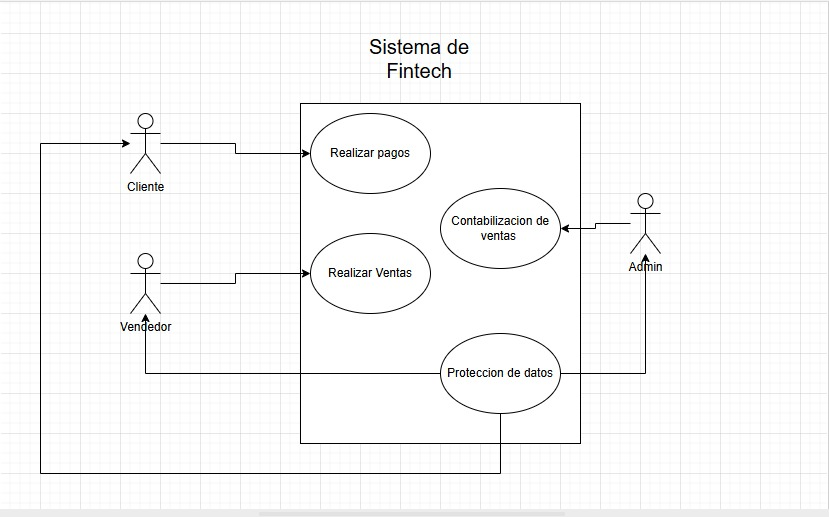

# FinPagTech - Levantamiento de Requerimientos de Software

Este repositorio contiene la documentación oficial para el desarrollo de la plataforma de pagos y conciliación bancaria de **FinPagTech**. El proyecto busca eliminar procesos manuales, asegurar la trazabilidad de la información y garantizar la estabilidad del sistema bajo alta demanda.

---

## 👥 Equipo de Desarrollo
* **Esteban Ocampo Ospina**
* **Alexis Rios Aguirre**
* **Daniel Florez Cortes**

---

## 📑 Historias de Usuario (HU)

### [HU: 01] Solución a Problemas Financieros
| Atributo | Detalle |
| :--- | :--- |
| **Módulo** | Desarrollo |
| **Rol** | Arquitecto de Software |
| **Prioridad** | Alta |
| **Riesgo** | Alta |
| **Desarrollador** | Daniel Flórez Cortes |

**Descripción:** Implementación de una plataforma de pagos para procesar operaciones en efectivo y electrónicas, eliminando hojas de cálculo. Incluye un módulo de conciliación bancaria detallado para alcanzar un 95% de éxito en el proceso.

**Actores:** Arquitecto de software, Contabilidad, Gerencia, Área operativa.  
> **Observaciones:** El sistema puede generar fallos en conciliaciones y registros por factores humanos o técnicos.

* **RF01 - Conciliación bancaria:** Módulo exclusivo para contabilidad y gerencia para optimizar tiempos y control.
* **NRF01 - Protocolo de protección de datos:** Seguridad para evitar fugas de información financiera según la ley.

---

### [HU: 02] Seguridad en la Red
| Atributo | Detalle |
| :--- | :--- |
| **Módulo** | Desarrollo |
| **Rol** | Arquitecto de Software |
| **Prioridad** | Alta |
| **Riesgo** | Alta |
| **Desarrollador** | Anderson Alexis Rios Aguirre |

**Descripción:** Mejoras en cumplimiento normativo para asegurar el tratamiento legal de los datos, garantizando que la privacidad de los usuarios no se vea comprometida.

**Actores:** Coordinador de ciberseguridad, Gerencia.  
> **Observaciones:** Implementación de controles de acceso estrictos, segmentación de red y encriptación.

* **RF02 - Manejo de información:** Encriptación de información y contraseñas sobre red local.
* **NRF02 - Documentación:** Trazabilidad de requerimientos y tickets bajo leyes de protección de datos.

---

### [HU: 03] Estabilidad y Optimización del Sistema
| Atributo | Detalle |
| :--- | :--- |
| **Módulo** | Desarrollo |
| **Rol** | Arquitecto de Software |
| **Prioridad** | Alta |
| **Riesgo** | Alta |
| **Desarrollador** | Juan Esteban Ocampo |

**Descripción:** Implementación de infraestructura en la nube para soportar el aumento progresivo de usuarios, garantizando disponibilidad en horas pico y evitando caídas.

**Actores:** Gerencia, Equipo de sistemas, Arquitecto de software.  
> **Observaciones:** Requiere estrategias de escalabilidad para permitir el crecimiento del proyecto.

* **RF03 - Concurrencia de usuarios:** Soporte garantizado para al menos 1,000 usuarios simultáneos con crecimiento progresivo.
* **NRF03 - Estabilidad y rendimiento:** Respuesta óptima con un rendimiento del 99.1% asegurado.

---

## ✅ Control de Aprobación

| Rol | Nombre | Firma | Fecha |
| :--- | :--- | :--- | :--- |
| **Estudiante 1** | Esteban Ocampo Ospina | ____________________ | 06/02/2026 |
| **Estudiante 2** | Alexis Rios Aguirre | ____________________ | 06/02/2026 |
| **Estudiante 3** | Daniel Florez Cortes | ____________________ | 06/02/2026 |

---

