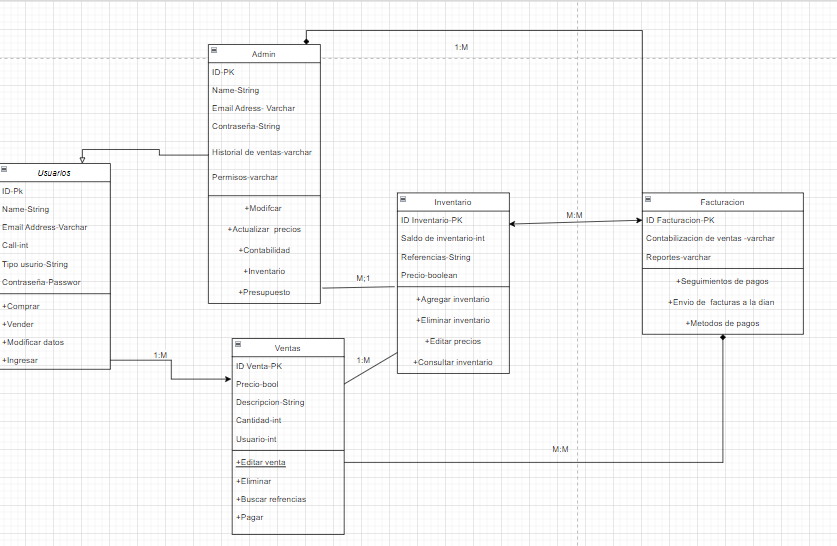

# 📊 Diagrama de Clases – Sistema de Ventas

Este proyecto representa un sistema de gestión de ventas que incluye control de usuarios, administración, inventario y facturación.

El diagrama de clases muestra la estructura del sistema, sus entidades principales y la relación entre ellas.

---

## 🧑‍💻 Clase: Usuarios

Representa a las personas que utilizan el sistema (clientes o vendedores).

### Atributos:
- ID (PK)
- Nombre
- Email
- Tipo de usuario
- Contraseña

### Métodos:
- Comprar()
- Vender()
- ModificarDatos()
- Ingresar()

### Relación:
Un usuario puede realizar múltiples ventas (1:M).

---

## 👨‍💼 Clase: Admin

Representa al administrador del sistema.

### Atributos:
- ID (PK)
- Nombre
- Email
- Contraseña
- Historial de ventas
- Permisos

### Métodos:
- Modificar()
- ActualizarPrecios()
- Contabilidad()
- GestionarInventario()
- Presupuesto()

### Relación:
El administrador gestiona el inventario y supervisa las operaciones del sistema.

---

## 💰 Clase: Ventas

Representa cada transacción realizada en el sistema.

### Atributos:
- IDVenta (PK)
- Precio
- Descripción
- Cantidad
- UsuarioID (FK)

### Métodos:
- EditarVenta()
- Eliminar()
- BuscarReferencias()
- Pagar()

### Relaciones:
- Un usuario puede tener muchas ventas (1:M).
- Una venta afecta el inventario.

---

## 📦 Clase: Inventario

Controla los productos disponibles para la venta.

### Atributos:
- IDInventario (PK)
- SaldoInventario
- Referencias
- Precio

### Métodos:
- AgregarInventario()
- EliminarInventario()
- EditarPrecios()
- ConsultarInventario()

### Relaciones:
- Se actualiza cuando se realiza una venta.
- Se relaciona con facturación (M:M).

---

## 🧾 Clase: Facturación

Gestiona las facturas y los pagos del sistema.

### Atributos:
- IDFacturacion (PK)
- ContabilizacionVentas
- Reportes

### Métodos:
- SeguimientoPagos()
- EnvioFacturas()
- MetodosPago()

### Relaciones:
- Se relaciona con ventas e inventario para generar facturas.

---

## 🔗 Tipos de Relaciones

- **1:M (Uno a Muchos)**  
  Un registro de una clase puede estar relacionado con varios registros de otra clase.  
  Ejemplo: Un usuario puede realizar muchas ventas.

- **M:M (Muchos a Muchos)**  
  Varias instancias de una clase pueden relacionarse con varias instancias de otra.  
  Ejemplo: Inventario y facturación.

---

## 🎯 Flujo General del Sistema

1. El usuario realiza una compra o venta.
2. Se registra la venta en el sistema.
3. El inventario se actualiza automáticamente.
4. Se genera la factura correspondiente.
5. El administrador supervisa y gestiona las operaciones.

---

Daniel - Esteban - Alexis 

