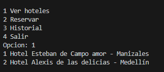
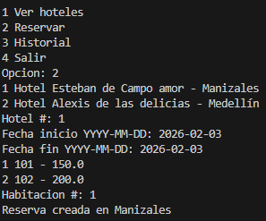
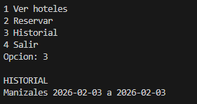
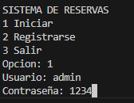
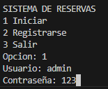

🏨 Sistema de Reservas de Hoteles en Python
👥 Integrantes

Daniel Florez

Alexis Rios

Esteban Ocampo

📌 Nombre del Proyecto

Sistema de Reservas de Hoteles

🖥 Lenguaje

El proyecto está desarrollado en Python utilizando Programación Orientada a Objetos (POO).

Python se utiliza porque permite:

Manejo sencillo de datos

Creación de sistemas modulares

Implementación rápida de lógica de negocio

Desarrollo de aplicaciones de consola

📊 Tipo de Proyecto

🔹 Tipo: Aplicación de consola / sistema de gestión

Este proyecto simula un sistema de reservas de hoteles donde los usuarios pueden interactuar mediante un menú en consola.

El sistema permite:
-
Registro de usuarios

Inicio de sesión

Visualización de hoteles

Consulta de habitaciones disponibles

Creación de reservas

Visualización del historial de reservas

⚙️ Funcionalidades del Sistema

El sistema incluye las siguientes funciones principales:

👤 Gestión de usuarios

Registro de nuevos usuarios

Inicio de sesión

Validación de credenciales

🏨 Gestión de hoteles

Crear hoteles

Agregar habitaciones

Listar hoteles disponibles

🛏 Gestión de habitaciones

Consultar disponibilidad de habitaciones

Control de fechas reservadas

Ver precios de habitaciones

📅 Gestión de reservas

Crear reservas

Asociar reservas a turistas

Guardar historial de reservas

Cancelar reservas

📂 Estructura del Proyecto
Proyecto
│
├── main.py
│
├── models
│   └── Model_Hoteleria.py
│
├── Services
│   ├── hotel_service.py
│   └── Reserva_Services.py
📄 main.py

Contiene:

Menú principal del sistema

Registro de usuarios

Inicio de sesión

Interacción del usuario con el sistema

📄 Model_Hoteleria.py

Define las clases principales del sistema:

Persona

Turista

Hotel

Habitacion

Reserva

Sucursal

📄 hotel_service.py

Contiene funciones relacionadas con:

Creación de hoteles

Agregar habitaciones

Consultar disponibilidad

📄 Reserva_Services.py

Contiene funciones para:

Crear reservas

Cancelar reservas

Historial de reservas 

▶ Cómo ejecutar el proyecto
1️⃣ Clonar el repositorio
git clone https://github.com/usuario/repositorio.git
2️⃣ Entrar a la carpeta del proyecto
cd repositorio
3️⃣ Ejecutar el programa
python main.py

El sistema iniciará mostrando el menú principal en consola.

🧠 Ejemplo de uso

Menú principal:

SISTEMA DE RESERVAS

1 Iniciar
2 Registrarse
3 Salir

Después de iniciar sesión el usuario puede:

1 Ver hoteles
2 Reservar
3 Historial
4 Salir
🧩 Tecnologías utilizadas

Python

Programación Orientada a Objetos (POO)

Manejo de fechas con datetime

Estructuras de datos (listas y diccionarios)

📚 Conceptos aplicados

En este proyecto se aplican varios conceptos de programación:

Clases y objetos

Herencia

Encapsulamiento

Listas y diccionarios

Manejo de fechas

Separación por capas (Model / Services / Main)

Si quieres, también puedo hacerte una versión más corta del README (la que normalmente piden los profesores) o una versión más profesional para GitHub con:

diagramas

badges

ejemplo de arquitectura MVC.